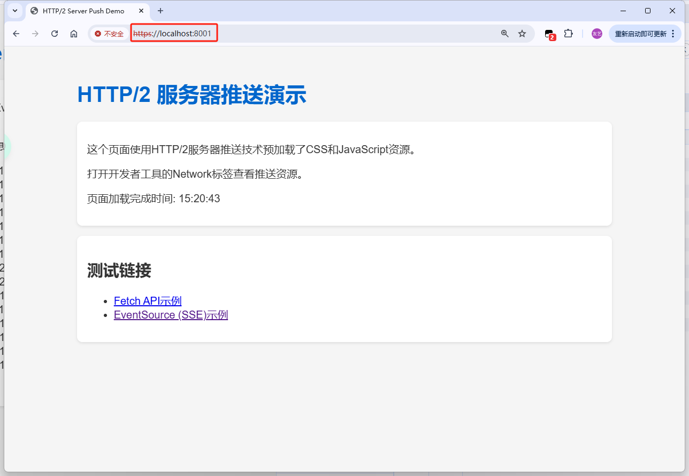
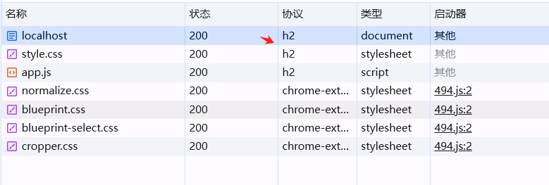
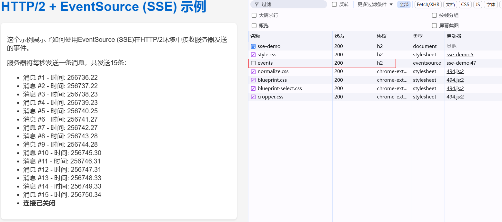
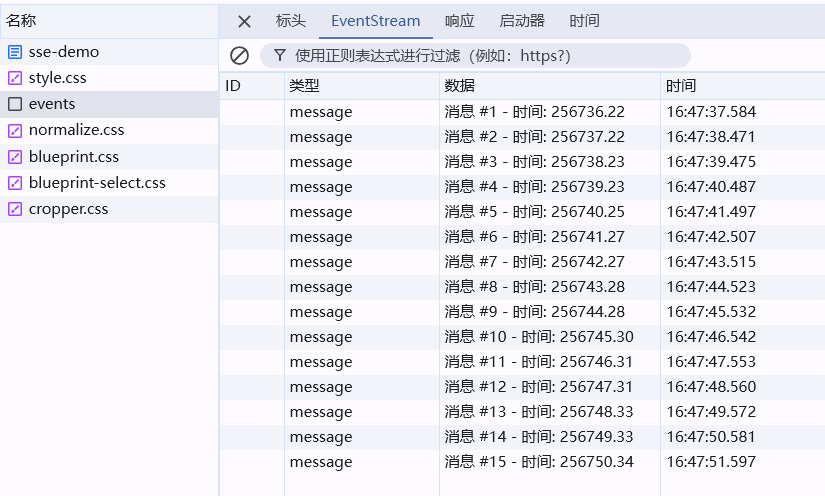

# HTTP/2 服务器推送演示

[](https://fastapi.tiangolo.com/)
[](https://www.python.org/)
[](https://http2.github.io/)
[](https://opensource.org/licenses/MIT)

基于FastAPI和Hypercorn实现的HTTP/2服务器推送演示项目，展示了如何利用HTTP/2的服务器推送特性提升Web应用性能。


## 项目特点

- 🚀 **HTTP/2服务器推送**：预加载CSS和JavaScript资源，减少页面加载时间
- 🔄 **多种通信方式**：同时演示HTTP/2环境下的Fetch API和EventSource (SSE)使用方法
- 🔒 **自动SSL配置**：内置证书生成工具，轻松配置HTTP/2所需的HTTPS环境
- 🛠️ **完整示例**：包含前端页面和后端API的完整实现代码

## 相关效果

### https协议



### HTTP/2服务器主动推送静态资源




### HTTP/2下的SSE






## 技术栈

- **后端**：FastAPI + Hypercorn (支持HTTP/2的ASGI服务器)
- **前端**：原生JavaScript + EventSource API
- **协议**：HTTP/2 + SSL/TLS

## 快速开始

### 环境要求

- Python 3.8+
- 支持HTTP/2的现代浏览器

### 安装步骤

1. 克隆仓库

```bash
git clone https://github.com/yourusername/http2-server-push-demo.git
cd http2-server-push-demo
```

2. 安装依赖

```bash
pip install fastapi hypercorn cryptography
```

3. 生成SSL证书（HTTP/2需要HTTPS）

**Linux/Mac环境**使用OpenSSL命令：

```bash
openssl req -x509 -newkey rsa:4096 -keyout key.pem -out cert.pem -days 365 -nodes
```

or **Windows环境可用**

```bash
python generate_cert.py
```

4. 启动服务器

```bash
python http2_server.py
```

5. 在浏览器中访问 https://localhost:8001

> **注意**：由于使用自签名证书，浏览器会显示安全警告，可以选择继续访问。

## 功能演示

### 主页 - HTTP/2服务器推送

主页演示了HTTP/2服务器推送功能，服务器会主动推送CSS和JavaScript资源，无需浏览器发起额外请求。

```python
# 设置Link头以触发HTTP/2服务器推送
response = HTMLResponse(content=html_content)
response.headers["Link"] = "</static/style.css>; rel=preload; as=style, </static/app.js>; rel=preload; as=script"
```

### Fetch API示例

展示如何在HTTP/2环境中使用Fetch API进行数据请求，体验HTTP/2多路复用带来的性能提升。

### EventSource (SSE)示例

展示如何使用EventSource接收服务器发送的事件流，实现实时数据推送。

## 技术对比

| 技术 | 适用场景 | 优势 | 劣势 |
|------|---------|------|------|
| **HTTP/2推送** | 静态资源预加载 | 减少RTT、提升首屏加载速度 | 不适合动态内容、可能浪费带宽 |
| **EventSource (SSE)** | 服务器到客户端的实时数据流 | 简单实现、自动重连 | 单向通信、有连接数限制 |
| **WebSocket** | 双向实时通信 | 全双工通信、低延迟 | 实现复杂、需要专门的服务器支持 |

## 选择建议

- **HTTP/2推送**：适用于静态资源预加载，如CSS、JS、关键图片等
- **EventSource**：适用于股票行情、日志流、通知等单向数据流场景
- **WebSocket**：适用于聊天应用、协作编辑、游戏等需要双向低延迟通信的场景

## 项目结构

```
.
├── http2_server.py      # 主服务器代码
├── generate_cert.py     # SSL证书生成工具
├── key.pem              # SSL私钥
├── cert.pem             # SSL证书
└── static/              # 静态资源目录
    ├── style.css        # 样式文件
    └── app.js           # JavaScript文件
```

## 参考资源

- [FastAPI官方文档](https://fastapi.tiangolo.com/)
- [Hypercorn文档](https://pgjones.gitlab.io/hypercorn/)
- [HTTP/2规范](https://http2.github.io/)
- [MDN Web文档：Server-sent events](https://developer.mozilla.org/en-US/docs/Web/API/Server-sent_events)
- [MDN Web文档：Fetch API](https://developer.mozilla.org/en-US/docs/Web/API/Fetch_API)

## 许可证

[MIT](LICENSE)